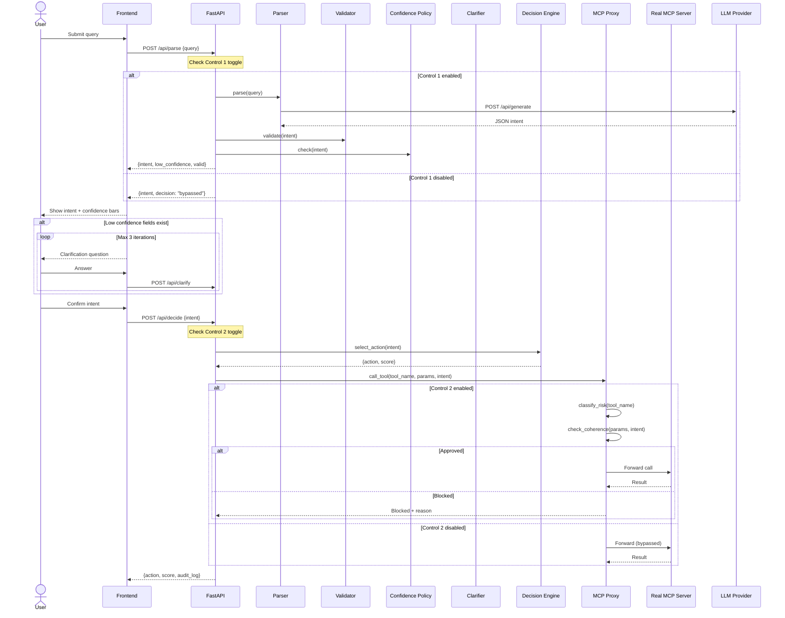
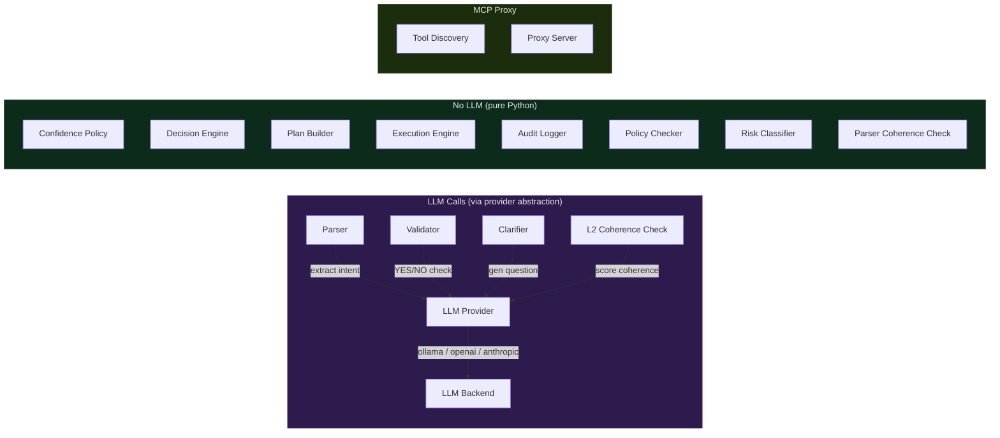

# Morpheus Architecture

## System Overview

Morpheus is a deterministic control layer with two independent controls:

```
User Input
  |
  v
[Control 1: Input Validation]
  Parser -> Validator -> Confidence Check -> Clarifier -> Decision Engine
  |
  v
[Control 2: Action Validation]
  MCP Proxy -> Risk Classification -> Coherence Check -> Forward/Block
  |
  v
Real MCP Tool Server
```

## Pipeline Sequence



## Component Architecture



## Two Independent Controls

| State | Behavior |
|-------|----------|
| Both on | Full validation pipeline |
| Control 1 off | Skips input validation, logs as "bypassed" |
| Control 2 off | Skips action validation, forwards all calls, logs as "bypassed" |
| Both off | No validation, everything logged as "bypassed" |

"Bypassed" is not an error — it is a deliberate, traceable decision.

## Risk Classification

```
Tool Name -> fnmatch against patterns -> Risk Level

  delete_*, remove_*, drop_*, destroy_*, purge_*                          -> HIGH   (blocked, requires confirmation)
  send_*, create_*, update_*, write_*, post_*, approve_*, request_*, export_*  -> MEDIUM (coherence check required)
  get_*, list_*, read_*, fetch_*, search_*, query_*, view_*              -> LOW    (auto-approved)
  (no match)                                      -> UNKNOWN (coherence check + confirmation)
```

## Audit Trail

Every event includes:
- `timestamp` (ISO 8601)
- `user` (default "system")
- `event_type` (e.g., "tool_call_intercepted", "policy_decision")
- `decision` ("approved" | "blocked" | "bypassed")
- `controls_active` (which controls were enabled)
- `policy_applied` (which policy matched)
- `payload` (event-specific data)

Pluggable sinks: InMemory, Console, File (JSONL with rotation).

## File Map

```
morpheus/
  main.py                # FastAPI app + endpoints
  controls.py            # Control 1 & 2 & coherence toggles
  audit/
    logger.py            # Enhanced audit with sinks + secret redaction
  parser/
    parser.py            # LLM-based intent parser
    sanitizer.py         # Input sanitization (injection, SQL, XSS, Unicode)
    coherence.py         # Parser output coherence check
    session_guard.py     # Cross-iteration anomaly detection
  validator/
    validator.py         # Two-phase validation
  clarifier/
    clarifier.py         # Answer validation + LLM question generation
  policies/
    confidence_policy.py # Per-field threshold + ambiguity detection
    ibac.py              # Intent-Based Access Control (authorization tuples)
  decision_engine/
    engine.py            # Deterministic action selection
  execution/
    plan.py              # Plan builder
    engine.py            # Plan executor with retry
    review.py            # Plan review (structural + constraint checks)
  domain/
    config.py            # Domain configuration + IBAC tuple templates
    registry.py          # Domain registry
    default_bi.py        # Default BI domain config
  proxy/
    discovery.py         # Dynamic tool discovery
    policy_checker.py    # Risk + coherence + policy (L1 + L2)
    proxy_server.py      # MCP proxy server
    mcp_bridge.py        # Standalone MCP proxy bridge (stdio, for Claude Desktop)
    http_proxy.py        # HTTP proxy service (for any integration)
  llm/
    provider.py          # Abstract LLM provider + auto-detection
    openai.py            # OpenAI provider
    ollama.py            # Ollama provider (local)
    anthropic.py         # Anthropic Claude provider
  sdk/
    client.py            # HTTP client
    types.py             # Pydantic models
    adapters/
      fastapi_middleware.py  # ASGI middleware
  mcp_server.py          # MCP tools for Claude Desktop/VS Code
  tests/
    run_all_tests.py     # Full test suite (148 tests, 15 layers)
    test_cases.py        # E2E mock tests
    mock_mcp_server.py   # Mock MCP server for proxy testing
```

## IBAC — Intent-Based Access Control

The validated intent generates **authorization tuples** that constrain every execution step.

```
Intent validated → IntentPolicyMapper → AuthorizationTuples
  → Each plan step checked: does it have a matching tuple?
  → Step authorized → execute
  → No matching tuple → BLOCKED

Example:
  Intent: {action_type: "view", hr_category: "payroll", data_subject: "self"}
  Tuples: [read:payroll:self, read:employee:self]

  Step "fetch_payroll_data" (requires: read:payroll) → matches read:payroll:self → ✓
  Step "send_to_ceo" (requires: write:email) → NO MATCH → BLOCKED
```

**Sensitive resources** require exact tuple match — wildcards are blocked:

```
Tuple: read:payroll:*
  → payroll:self       → ✓ (not sensitive)
  → payroll:ceo        → ✗ (sensitive, wildcard blocked)
  → payroll:ceo (exact tuple) → ✓ (exact always works)
```

The `TupleEvaluator` is a Protocol — replaceable with Cedar, OPA, or OpenFGA:

```python
class TupleEvaluator(Protocol):
    def evaluate(self, tuples: list[AuthorizationTuple], step: dict) -> EvaluationResult: ...
```

## Plan Review

Validates execution plans before they run:

| Check | What it catches |
|-------|----------------|
| Empty plan | No steps to execute |
| Step ordering (pure → reversible → side_effect) | Irreversible action before verification |
| Max total timeout | Plan would run too long |
| Max side-effect steps | Too many irreversible operations |
| Max retries per step | Retry storms |
| IBAC tuple enforcement | Step accessing unauthorized resources |
